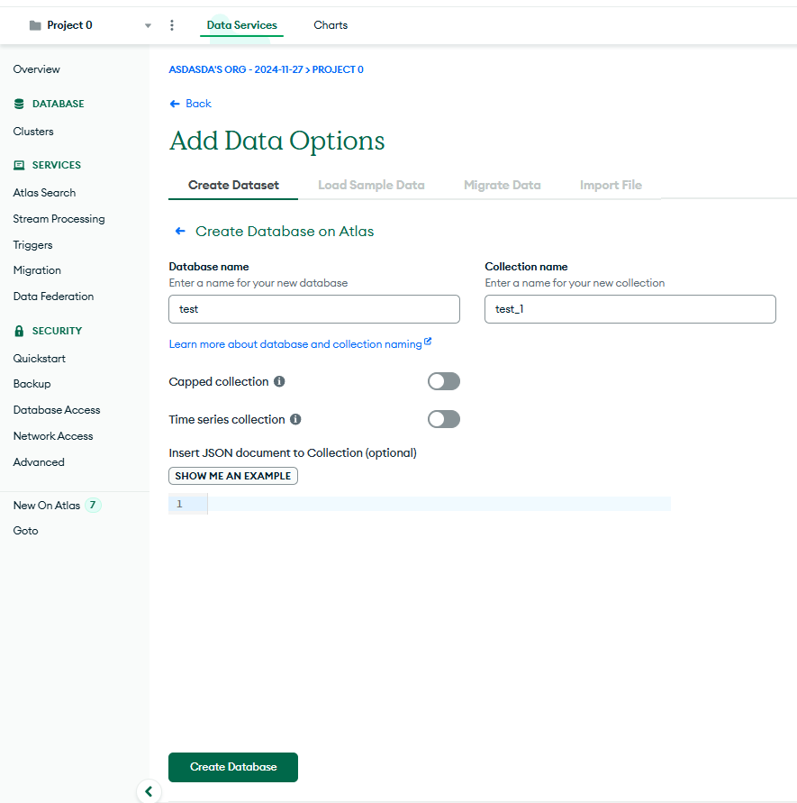

# Cuaderno de Laboratorio - Guía de Inicio Rápido - Backend

## **Requisitos previos**

1. **Node.js** (versión < 18)  

   Instálalo siguiendo las instrucciones en [Node.js Official Website](https://nodejs.org/).

2. **MongoDB Atlas (DB Cloud) _RECOMENDADO_**

   Servicio remoto de base de datos de MongoDB.
   Crearse una cuenta en [MongoDB Official Website MongoDB Atlas](https://www.mongodb.com/es/atlas).

3. **MongoDB (DB local) _OPCIONAL_**  

   Servidor local de MongoDB.
   Recomendado para hacer pruebas en local.

   Instálalo siguiendo las instrucciones en [MongoDB Official Website MongoDB community](https://www.mongodb.com/try/download/community).

4. **Mongo compass _OPCIONAL_**

   Herramienta gráfica oficial proporcionada por MongoDB para interactuar con bases de datos.
   Con la instalación del servidor local de MongoDB ya se instala esta aplicación.

   También sirve para interactuar con MongoDB Atlas.

   Instálalo siguiendo las instrucciones en [MongoDB Official Website MongoDB compass](https://www.mongodb.com/try/download/compass).

---

## **Pasos para el despliegue**

### 1. Clonar el repositorio del backend

Navegar al directorio donde va a estar el backend y ejecutar el comando:

```bash
git clone https://github.com/DesApp-2024c1-Grupo-3/cuaderno-de-laboratorio-back.git
```

### 2. Cambiar a rama dev

En el directorio raíz donde está el backend ejecutar el comando:

```bash
git checkout dev
```

### 3. Instalar dependencias

En el directorio raíz donde está el backend ejecutar el comando:

```bash
npm install
```

### 4. Configurar Base de datos.

Se deja por defecto una DB creada y funcionando, que funciona con las variables del archivo `.env.example`.

* Copia las variables de entorno necesarias para interactuar con la BD Cloud.

```bash
cp .env.example .env
```

> Si se desea crear una **DB nueva**, o utilizar una **DB en local**, seguir las indicaciones mencionadas al final de este instructivo. (Ver sección **Creación y selección de Base de datos**)

### 5. Iniciar servidor Backend

En el directorio raíz donde está el backend ejecutar el comando:

```bash
npm start
```

---

## **Creación y selección de Base de datos**

### DB Local

Una vez instalado **MongoDB community** ya estaría funcionando la **DB** en el puerto `27017`.
Se debe indicar a Mongoose con que base de datos **conectarse**, y finalmente insertar **datos mock**.

Para ello:

* Descomentar `const uri` correspondiente a la DB Local en el archivo `config\db.js`.

* Comentar `const uri` correspondiente a la DB Cloud en el archivo `config\db.js`.

* En el directorio raíz donde está el backend ejecutar el comando:

   ```bash
   node .\config\insertarDatosMock.js
   ```

### DB Remoto

> La base de datos remota es única, y todos los integrantes del grupo tienen acceso a la misma. Por lo que **cualquier cambio** se verá reflejado para **todos los integrantes** del grupo.

* Copia las variables de entorno necesarias para interactuar con la BD Cloud.

```bash
cp .env.example .env
```

Con la cuenta de MongoDB Atlas creada:

* Crear un cluster **FREE**.

* Nombrar cluster.

* Seleccionar región (Recomendado Sao Paulo).

* Destildar opción **Preload sample dataset**.


* Copiar a archivo `.env` **USER_NAME** y **DB_PASSWORD**.


* Haz clic en el botón **Create Database User**.

* Haz clic en el botón **Choose a connection method**.

* Conectar al cluster con la opción **MongoDB for VS Code**.


* Copiar a archivo `.env` **CLUSTER_NAME**.


* Haz clic en el botón **Done**.

* Ir a la pestaña **Network Access**.

* Haz clic en el botón **Add ip address**.


* Haz clic en el botón **Allow access from anywhere**.

* Haz clic en el botón **Confirm**.


* Ir a la pestaña **Overview**.

* Haz clic en el botón **Add data**.


* Haz clic en el botón **Create Database on Atlas**.


* Nombrar Base de datos.

* Nombrar colección inicial (obligatorio, sin uso).

* Copiar a archivo `.env` **DATABASE_NAME**.

* Haz clic en el botón **Create Database**.




* En el directorio raíz donde está el backend ejecutar el comando:

   ```bash
   node .\config\insertarDatosMock.js
   ```

---

## Swagger

Para consultar la documentación de la API (Swagger) acceder a la siguiente URL con el servidor backend ejecutándose:

[http://localhost:8080/api-docs](http://localhost:8080/api-docs)

